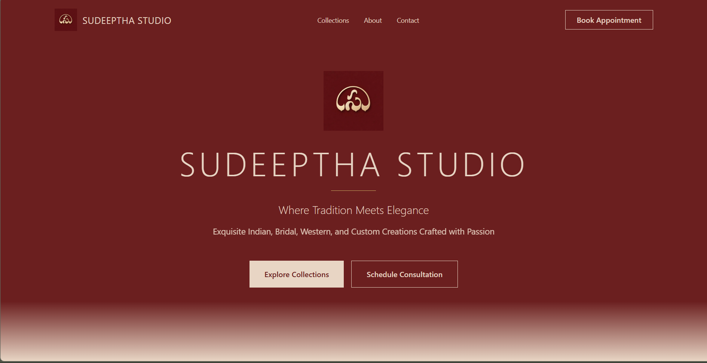

# Sudeeptha Studio Website

Frontend website prototype for **Sudeeptha Studio**.  
The interface was designed entirely in **Figma**, and the generated code bundle was deployed online for preview.

## Live Website

https://sudeeptha-final.vercel.app

## Overview

This project represents an early version of the Sudeeptha Studio website.  
The design and layout were created in Figma, and the generated frontend code was deployed to the web for preview and testing.

The project demonstrates the workflow of **designing interfaces in Figma and deploying them as a working website**.

## Features

- UI layout designed fully in Figma
- Responsive design structure
- Basic page navigation and interactions
- Modern frontend build setup
- Deployed online for preview

## Technologies Used

- Figma (UI Design)
- HTML
- CSS
- TypeScript
- Vite
- Vercel (deployment)

## Project Structure

```
src/                → frontend source files
index.html          → main HTML entry point
package.json        → project dependencies
vite.config.ts      → Vite configuration
postcss.config.mjs  → PostCSS configuration
```

## Running the Project Locally

Install dependencies:

```
npm install
```

Start the development server:

```
npm run dev
```

## Deployment

The project is deployed using **Vercel**, which provides fast hosting and automatic builds from the repository.

## Note

This is an **early prototype of the studio website**.  
Some images and content are placeholders while the studio builds its full portfolio.

## Preview


